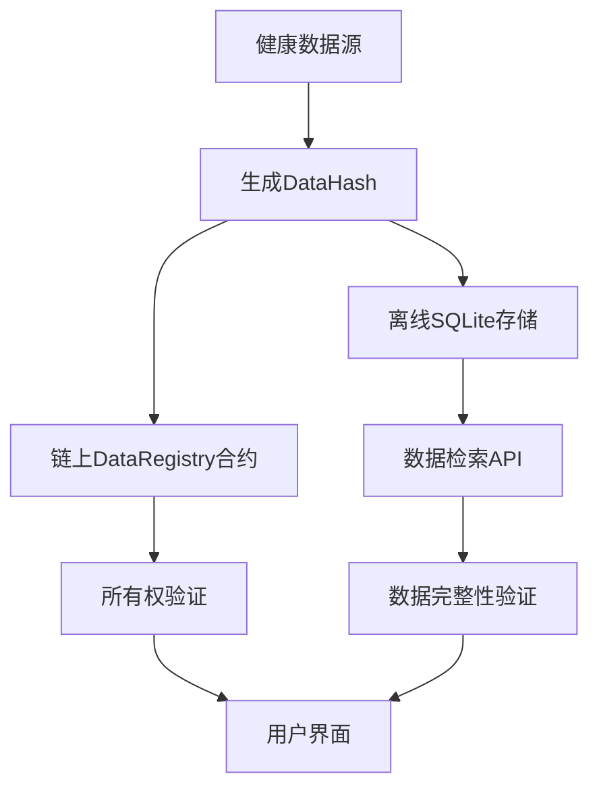

# Health Data Storage Optimization

## 概述

本优化方案实现了健康数据的双重存储架构：
- **链上存储**: 存储DataHash（数据哈希）用于数据完整性和所有权验证
- **离线存储**: 使用SQLite数据库存储实际健康数据和DataHash的映射关系

## 架构设计

### 数据流图



### 核心组件

1. **DataRegistry智能合约** (`/contracts/DataRegistry.sol`)
   - 存储DataHash和基本元数据
   - 管理数据所有权和访问权限
   - 提供数据注册和检索功能

2. **后端API服务** (`/backend/server.js`)
   - SQLite数据库管理
   - 健康数据存储和检索
   - DataHash生成和验证

3. **前端API客户端** (`/frontend/src/utils/api.js`)
   - 与后端API交互
   - 提供统一的健康数据管理接口

## 技术实现

### DataHash生成算法

DataHash使用SHA-256算法生成，确保数据的唯一性和完整性：

```javascript
const dataHash = crypto.createHash('sha256')
    .update(JSON.stringify({
        userId: user.id,
        dataType: dataType,
        actualData: actualData,
        timestamp: Date.now()
    }))
    .digest('hex');
```

### 数据库表结构

#### health_data 表
```sql
CREATE TABLE health_data (
    id INTEGER PRIMARY KEY AUTOINCREMENT,
    user_id INTEGER NOT NULL,
    data_hash TEXT UNIQUE NOT NULL,          -- 链上存储的DataHash
    data_type TEXT NOT NULL,                 -- 数据类型
    actual_data TEXT NOT NULL,               -- 实际健康数据（JSON）
    metadata TEXT,                           -- 元数据（JSON）
    created_at DATETIME DEFAULT CURRENT_TIMESTAMP,
    updated_at DATETIME DEFAULT CURRENT_TIMESTAMP,
    FOREIGN KEY (user_id) REFERENCES users (id)
);
```

### API端点

#### 1. 存储健康数据
```http
POST /api/health-data/store
Content-Type: application/json
Authorization: Bearer <token>

{
    "dataType": "daily_metrics",
    "actualData": {
        "steps": 8532,
        "heartRate": 72,
        "sleepMinutes": 420
    },
    "metadata": {
        "device": "Fitbit Charge 5",
        "qualityScore": 95
    }
}
```

响应：
```json
{
    "message": "Health data stored successfully",
    "dataHash": "a1b2c3d4e5f6...",
    "dataId": 123
}
```

#### 2. 检索健康数据
```http
GET /api/health-data/:dataHash
Authorization: Bearer <token>
```

响应：
```json
{
    "dataHash": "a1b2c3d4e5f6...",
    "dataType": "daily_metrics",
    "actualData": {
        "steps": 8532,
        "heartRate": 72,
        "sleepMinutes": 420
    },
    "integrityValid": true,
    "createdAt": "2024-01-15T10:30:00Z"
}
```

#### 3. 数据完整性验证
```http
POST /api/health-data/verify
Content-Type: application/json
Authorization: Bearer <token>

{
    "dataHash": "a1b2c3d4e5f6...",
    "dataType": "daily_metrics",
    "actualData": {
        "steps": 8532,
        "heartRate": 72
    }
}
```

## 使用示例

### 1. 完整的数据存储流程

```javascript
// 导入集成类
const HealthDataIntegration = require('../examples/health-data-integration');

// 初始化
const integration = new HealthDataIntegration(
    '0xYourContractAddress',
    contractABI
);

// 设置认证
integration.setAuthToken('your-jwt-token');
await integration.initializeEthereum('your-private-key');

// 存储健康数据
const result = await integration.storeHealthDataWithBlockchain({
    userId: 1,
    dataType: 'daily_metrics',
    actualData: {
        steps: 8532,
        heartRate: 72,
        sleepMinutes: 420
    },
    metadata: {
        device: 'Fitbit Charge 5'
    }
});

console.log('Data stored:', result);
```

### 2. 数据检索和验证

```javascript
// 检索数据
const healthData = await integration.retrieveHealthData('a1b2c3d4e5f6...');

if (healthData.isComplete) {
    console.log('Data is complete and valid');
    console.log('Chain data:', healthData.chainData);
    console.log('Offline data:', healthData.offlineData);
}
```

### 3. 批量验证

```javascript
// 批量验证用户所有数据
const batchResults = await integration.batchVerifyUserData();

const validRecords = batchResults.filter(r => r.existsOnChain && r.integrityValid);
console.log(`Valid records: ${validRecords.length}/${batchResults.length}`);
```

## 前端集成

### 使用HealthChainAPI类

```javascript
import { healthChainAPI } from './utils/api.js';

// 存储健康数据
const storageResult = await healthChainAPI.storeHealthData({
    dataType: 'heart_rate',
    actualData: { bpm: 72, timestamp: Date.now() },
    metadata: { source: 'Apple Watch' }
});

// 将DataHash注册到区块链
const dataHash = storageResult.dataHash;
// ... 调用智能合约注册dataHash

// 检索数据
const healthData = await healthChainAPI.getHealthDataByHash(dataHash);
```

## 安全特性

### 1. 数据完整性保护
- DataHash确保数据在传输和存储过程中不被篡改
- 每次检索都会重新计算DataHash进行验证

### 2. 访问控制
- JWT令牌认证
- 用户只能访问自己的数据
- 链上所有权验证

### 3. 隐私保护
- 实际健康数据存储在离线数据库
- 链上只存储不可逆的DataHash
- 支持数据删除（被遗忘权）

## 性能优化

### 1. 数据库索引
```sql
CREATE INDEX idx_health_data_user_id ON health_data(user_id);
CREATE INDEX idx_health_data_hash ON health_data(data_hash);
CREATE INDEX idx_health_data_type ON health_data(data_type);
CREATE INDEX idx_health_data_created ON health_data(created_at);
```

### 2. 分页查询
- 支持分页参数（page, limit）
- 按数据类型过滤
- 按时间排序

### 3. 缓存策略
- 频繁访问的数据可以缓存
- DataHash验证结果缓存

## 部署说明

### 1. 数据库初始化
```bash
cd backend
npm install
node server.js
```

### 2. 智能合约部署
```bash
cd contracts
npx hardhat compile
npx hardhat deploy --network localhost
```

### 3. 前端配置
```javascript
// 更新合约地址和ABI
const CONTRACT_ADDRESS = '0xYourDeployedContractAddress';
const CONTRACT_ABI = require('./artifacts/contracts/DataRegistry.sol/DataRegistry.json').abi;
```

## 故障排除

### 常见问题

1. **DataHash不匹配**
   - 检查数据生成算法是否一致
   - 验证时间戳格式

2. **链上数据不存在**
   - 确认交易是否成功
   - 检查合约事件日志

3. **数据库连接错误**
   - 检查SQLite文件权限
   - 验证数据库路径

### 日志调试

启用详细日志记录：
```javascript
// 后端调试
DEBUG=healthchain:* node server.js

// 前端调试
localStorage.debug = 'healthchain:*';
```

## 扩展建议

### 1. 数据加密
- 支持端到端加密
- 可选的加密密钥管理

### 2. 数据同步
- 多设备数据同步
- 冲突解决策略

### 3. 数据分析
- 集成数据分析工具
- 健康趋势分析

## 结论

本优化方案通过链上DataHash和离线SQLite存储的结合，实现了：
- ✅ 数据完整性和不可篡改性
- ✅ 高性能的数据检索
- ✅ 用户隐私保护
- ✅ 可扩展的架构设计
- ✅ 符合GDPR的被遗忘权要求

这种架构特别适合需要兼顾数据安全性和性能的健康数据管理应用。